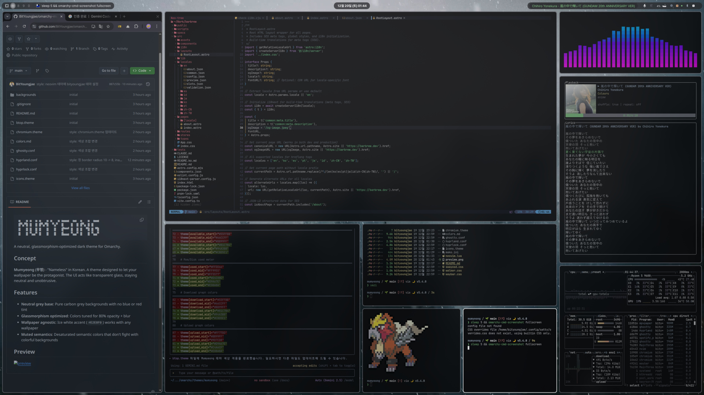

```
▗▖  ▗▖▗▖ ▗▖▗▖  ▗▖▗▖  ▗▖▗▄▄▄▖ ▗▄▖ ▗▖  ▗▖ ▗▄▄▖
▐▛▚▞▜▌▐▌ ▐▌▐▛▚▞▜▌ ▝▚▞▘ ▐▌   ▐▌ ▐▌▐▛▚▖▐▌▐▌
▐▌  ▐▌▐▌ ▐▌▐▌  ▐▌  ▐▌  ▐▛▀▀▘▐▌ ▐▌▐▌ ▝▜▌▐▌▝▜▌
▐▌  ▐▌▝▚▄▞▘▐▌  ▐▌  ▐▌  ▐▙▄▄▖▝▚▄▞▘▐▌  ▐▌▝▚▄▞▘
```

A neutral, glassmorphism-optimized dark theme for Omarchy.

## Concept

**Mumyeong (무명)** - "Nameless" in Korean. A theme designed to let your wallpaper be the protagonist. The UI acts like transparent glass, staying neutral and unobtrusive.

## Features

- **Neutral grey base**: Pure carbon grey backgrounds with no blue or red tint
- **Glassmorphism optimized**: Colors tuned for 80% opacity + blur
- **Wallpaper agnostic**: Ice white accent (`#E2E8F0`) works with any wallpaper
- **Muted semantics**: Desaturated semantic colors that don't fight with colorful backgrounds

## Preview


