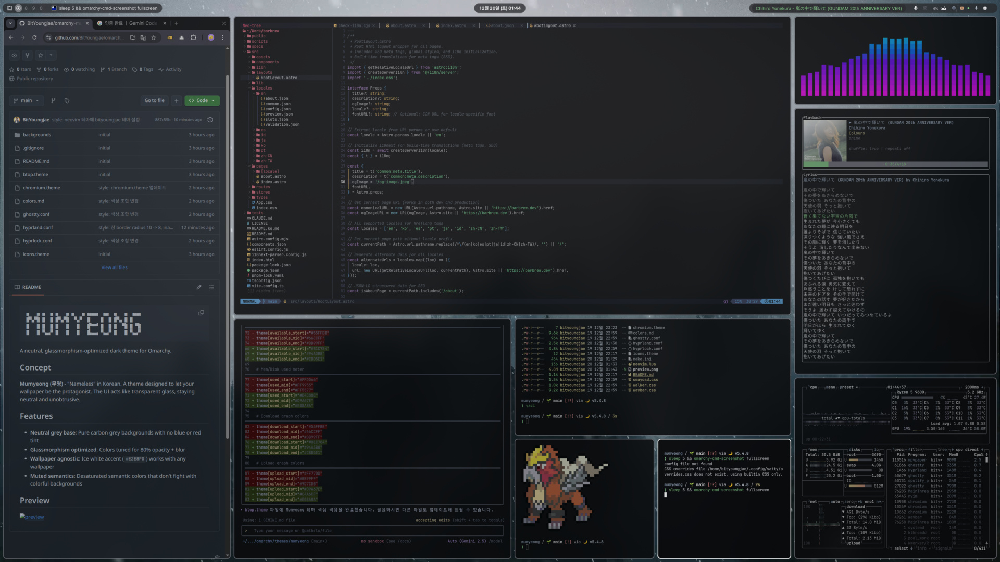

```
▗▖  ▗▖▗▖ ▗▖▗▖  ▗▖▗▖  ▗▖▗▄▄▄▖ ▗▄▖ ▗▖  ▗▖ ▗▄▄▖
▐▛▚▞▜▌▐▌ ▐▌▐▛▚▞▜▌ ▝▚▞▘ ▐▌   ▐▌ ▐▌▐▛▚▖▐▌▐▌
▐▌  ▐▌▐▌ ▐▌▐▌  ▐▌  ▐▌  ▐▛▀▀▘▐▌ ▐▌▐▌ ▝▜▌▐▌▝▜▌
▐▌  ▐▌▝▚▄▞▘▐▌  ▐▌  ▐▌  ▐▙▄▄▖▝▚▄▞▘▐▌  ▐▌▝▚▄▞▘
```

A neutral, glassmorphism-optimized dark theme for Omarchy.

## Concept

**Mumyeong (무명)** - "Nameless" in Korean. A theme designed to let your wallpaper be the protagonist. The UI acts like transparent glass, staying neutral and unobtrusive.

## Features

- **Neutral grey base**: Pure carbon grey backgrounds with no blue or red tint
- **Glassmorphism optimized**: Colors tuned for 80–90% opacity + blur
- **Wallpaper agnostic**: Ghost silver accent (`#F4F4F5`) works with any wallpaper
- **Muted semantics**: Desaturated semantic colors that don't fight with colorful backgrounds

## Install

```bash
omarchy theme install https://github.com/<your-fork>/omarchy-mumyeong-theme.git
# or symlink/copy this directory into ~/.config/omarchy/themes/mumyeong
omarchy theme set "Mumyeong"
```

## Preview


